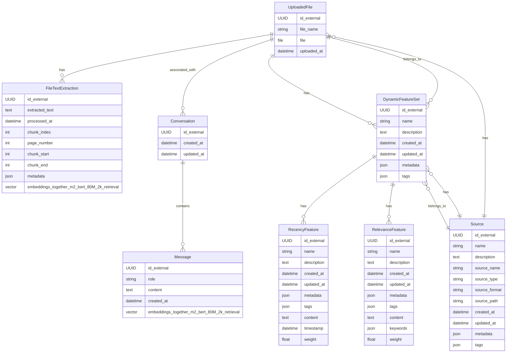

I was happy to see generous customization options in the Hobby tier, with even more robust customization available to paid customers with custom CSS/JS.

## Built-in Components

### Mermaid

I love Mermaid diagrams. I often use Mermaid entity relationship diagrams to help me visualize data models and schema relationships. Including Meraid diagrams in the documentation easily is one of my favorite features.

The diagram below is an old draft ERD from a project I recently worked on.

## Icons

Great icons put just the right finishing touches on a site. Not having to handle that on my side makes the experience so much better, and the look and feel of the docs site speaks for itself.