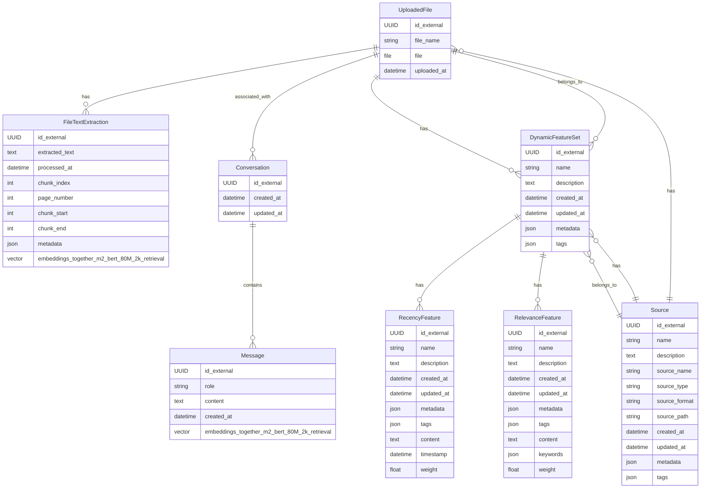

I was happy to see generous customization options built into the core product (and available in the Hobby tier), with even more robust customization available to paid customers. Sometimes I think companies miss the mark with drawing lines on their free-tier subscriptions and end up neglecting to show the user how easily a product can be customized to match their branding.

## Built-in Components

### Built in Mermaid ERD? Sign me up!

I love Mermaid diagrams. I often use Mermaid entity relationship diagrams to help me visualize data model structures and schemas relationships. Being able to easily include Meraid diagrams in the documentation is easily one of my favorite features.

The diagram below is an old draft ERD I had from a project I was recently working on.

## Icons

Ok, I am kind of a sucker for Font Awesome icons. Not having to handle that on my side makes the experience so much better, and the look and feel of the docs site speaks for itself.

## 